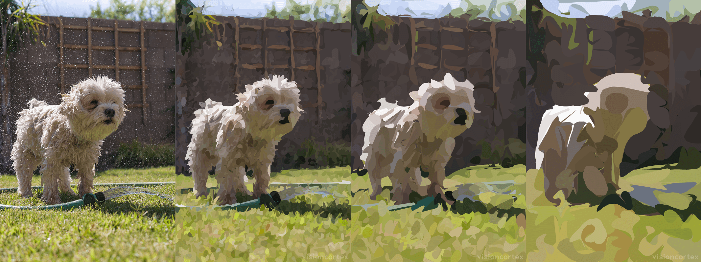

  
  <h1>VisionMagic</h1>

  

    <strong>Collection of vision & graphics algorithms</strong>
  

  <h3>
    <a href="//www.visioncortex.org/visionmagic-docs">Paper</a>
     | 
    <a href="//www.visioncortex.org/visionmagic/">Demo</a>
     | 
    <a href="//docs.rs/visionmagic">Docs</a>
  </h3>

  Built with 🦀 by <a href="//www.visioncortex.org/">The Vision Cortex Research Group</a>

## Simplification

.

Different levels of simplification

## Segmentation

